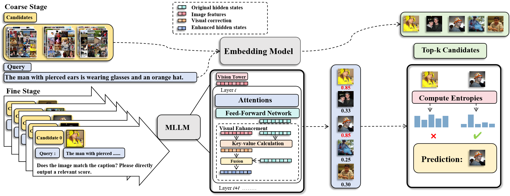

# RETLLM: Training- and Data-Free Multimodal Large Language Models for Information Retrieval

> 🚀 Official repository for **RETLLM** — a framework for zero-shot multimodal retrieval without additional training or domain-specific data.

- **2025.09.25**: Initial source code released.
---
## Framework

---

## 📄 Paper  
Coming soon! 

---

## 🗂️ Dataset Preparation

RETLLM is evaluated on a diverse set of multimodal retrieval benchmarks. To set up the evaluation datasets, please follow the official instructions from the respective repositories:

| Dataset            | Description                                      | Setup Guide |
|--------------------|--------------------------------------------------|-------------|
| **Flickr30k & COCO** | Standard image-text retrieval benchmarks         | [Flickr30k & COCO](https://github.com/kongds/E5-V#datasets) |
| **ShareGPT4V & Urban1k** | Long-caption and urban-scene retrieval           | [ShareGPT4V & Urban1k](https://github.com/beichenzbc/Long-CLIP#evaluation) |
| **SugarCrepe**     | Fine-grained image-text pairs with subtle semantic variations | [SugarCrepe](https://github.com/RAIVNLab/sugar-crepe) |
| **MMEB**           | Multimodal Embedding Benchmark (MMEB)            | [MMEB](https://github.com/TIGER-AI-Lab/VLM2Vec#inference--evaluation) |

> 💡 **Note**: Ensure images and annotations are correctly organized according to each dataset’s expected format before evaluation.

---

## ▶️ Evaluation

Once datasets are prepared, run the corresponding evaluation scripts:

```bash
# Flickr30k & COCO
python3 Codes/main_retrieval_v2.py

# ShareGPT4V & Urban1k
python3 Codes/main_retrieval_long.py

# SugarCrepe
python3 main_eval.py

# MMEB
python3 Codes_MMEB/eval.py
